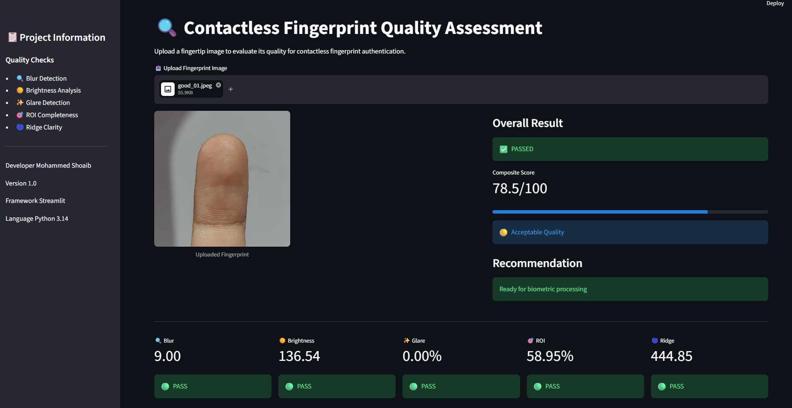
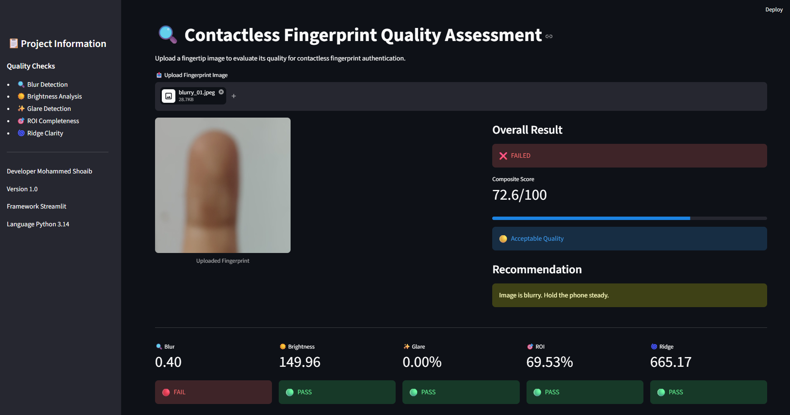
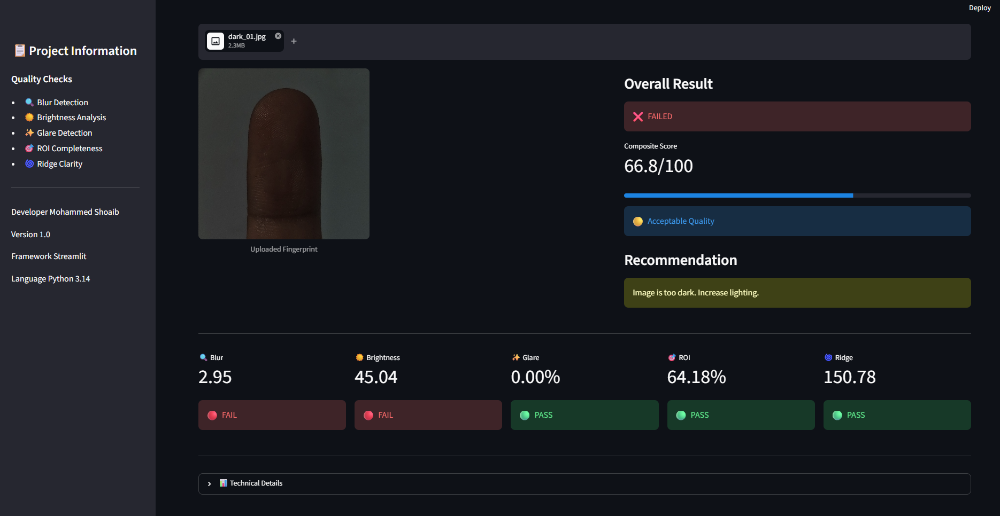
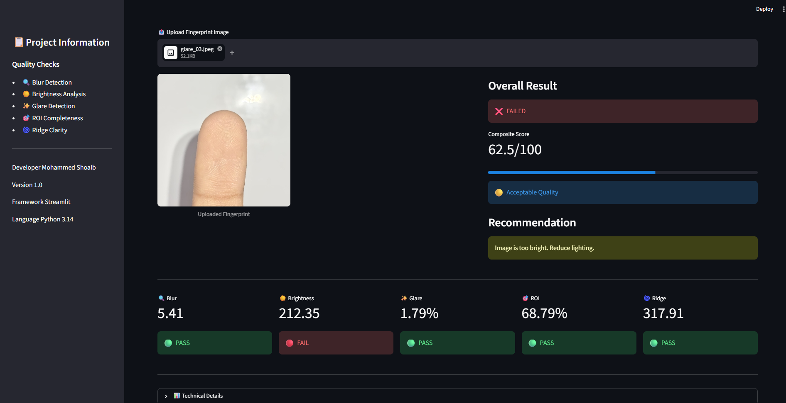

# 🔍 Contactless Fingerprint Quality Assessment System

An AI-powered Computer Vision system that evaluates the quality of **contactless fingerprint images** captured using a smartphone camera before biometric authentication.

This project simulates the quality assessment stage of a contactless fingerprint authentication pipeline by checking whether an image is suitable for further biometric processing.

---

# 📌 Problem Statement

Traditional fingerprint authentication relies on contact-based scanners. Contactless fingerprint recognition using smartphone cameras introduces challenges such as:

- Blur
- Poor illumination
- Glare
- Partial fingerprint capture
- Poor ridge visibility

The objective of this project is to automatically assess fingerprint image quality and provide immediate feedback before biometric feature extraction.

---

# 🚀 Features

- ✅ Blur Detection (Variance of Laplacian)
- ✅ Brightness Analysis
- ✅ Glare Detection
- ✅ ROI (Region of Interest) Completeness
- ✅ Ridge Clarity Analysis (Gabor Filter)
- ✅ Composite Quality Score
- ✅ PASS / FAIL Decision
- ✅ User Guidance
- ✅ Interactive Streamlit Dashboard
- ✅ Batch Dataset Evaluation

---

# 🏗️ System Architecture

```
Mobile Camera
      │
      ▼
Fingerprint Image
      │
      ▼
Quality Assessment
 ├── Blur Detection
 ├── Brightness Analysis
 ├── Glare Detection
 ├── ROI Completeness
 └── Ridge Clarity
      │
      ▼
Score Normalization
      │
      ▼
Composite Quality Score
      │
      ▼
PASS / FAIL
      │
      ▼
User Guidance
```

---

# 🛠️ Tech Stack

- Python
- OpenCV
- NumPy
- Pandas
- Streamlit
- Git
- GitHub

---

# 📂 Project Structure

```text
contactless-fingerprint-qc/
│
├── quality_assessment.py
├── quality_app.py
├── test_quality.py
├── test_results.csv
├── requirements.txt
├── README.md
│
├── test_dataset/
│   ├── good/
│   ├── blurry/
│   ├── dark/
│   └── glare/
│
└── screenshots/
```

---

# ⚙️ Installation

## Clone Repository

```bash
git clone https://github.com/mohd-Shoaib-ali/contactless-fingerprint-qc
cd contactless-fingerprint-qc
```

---

## Create Virtual Environment

```bash
python -m venv venv
```

---

## Activate

Windows

```bash
venv\Scripts\activate
```

Linux / macOS

```bash
source venv/bin/activate
```

---

## Install Dependencies

```bash
pip install -r requirements.txt
```

---

# ▶️ Run Streamlit App

```bash
streamlit run quality_app.py
```

---

# 🧪 Batch Testing

```bash
python test_quality.py
```

The script processes all images inside the dataset folder and generates:

```
test_results.csv
```

---

# 📊 Quality Metrics

| Metric | Technique |
|---------|-----------|
| Blur | Variance of Laplacian |
| Brightness | Mean Grayscale Intensity |
| Glare | Overexposed Pixel Ratio |
| ROI | Contour Area Ratio |
| Ridge Clarity | Gabor Filter |

---

# 📈 Composite Score

The system normalizes individual quality metrics and computes a weighted composite quality score.

The image is accepted only if:

- Composite score ≥ Threshold
- No hard quality failures detected

Otherwise, the system returns guidance such as:

- Image is blurry
- Too dark
- Too bright
- Glare detected
- ROI incomplete
- Ridge clarity poor


## Demo

### Good Image


### Blurry Image


### Dark Image


### Glare Image


# 🚀 Future Improvements

- Finger Detection
- Liveness Detection
- Finger Segmentation
- Image Enhancement
- Minutiae Extraction
- ISO/IEC 19794-4 Template Generation
- Fingerprint Matching
- Deep Learning Based Quality Assessment

---

# 👨‍💻 Author

**Shoaib Mohammed**

GitHub:

https://github.com/mohd-Shoaib-ali

LinkedIn:
https://www.linkedin.com/in/shoaib-mohammed-b72669225/

GitHub:
https://github.com/mohd-Shoaib-ali/contactless-fingerprint-qc

